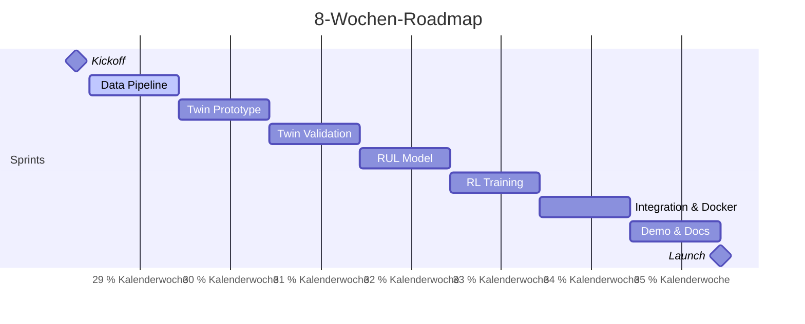

# Predictive-Maintenance Digital-Twin RL

## Projekt-Pitch
Dieses Repository demonstriert ein KI-gestütztes Predictive-Maintenance-Showcase, das Ausfälle vorhersagt, einen physikbasierten Digital-Twin simuliert und per Reinforcement Learning den Betrieb optimiert. Es liefert reproduzierbare Pipelines, nachvollziehbare Metriken und eine sofort nutzbare Demo.

## Badges
[](https://github.com/J-Fasterling/Anomalie-Detector/actions/workflows/ci.yml)
[](TODO)

## Projektstruktur
```text
.
├── data
│   ├── processed
│   └── raw
├── deploy
├── docs
├── notebooks
├── README.md
├── SCOPE.md
├── scripts
│   └── setup_repo.sh
├── src
│   ├── __init__.py
│   ├── ml/     …
│   ├── rl/     …
│   ├── stream/     …
│   └── twin/     …
└── tests
    └── __init__.py
```

## Roadmap


## Quickstart
- **Klonen & Wechseln:**  
  `git clone https://github.com/J-Fasterling/Anomalie-Detector.git && cd Anomalie-Detector`
- **Einrichten & Demo starten:**  
  `./scripts/setup_repo.sh`  # installiert Abhängigkeiten, lädt Daten, baut Container
- **CI prüfen:** Commit pushen oder PR öffnen – Badge oben muss grün sein